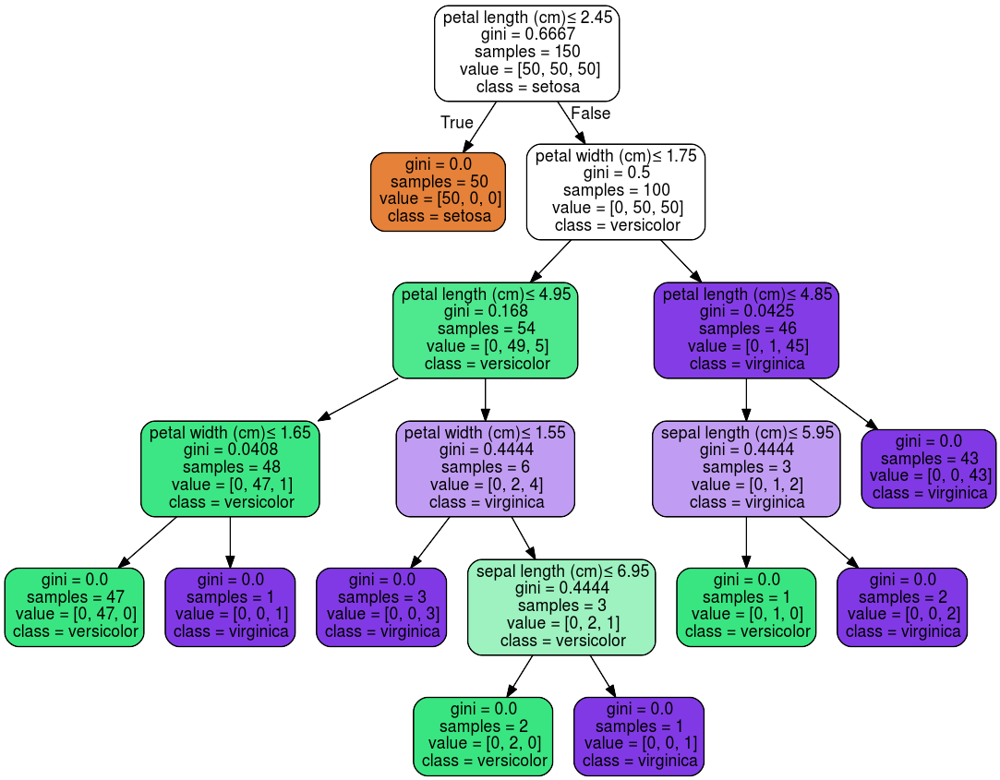
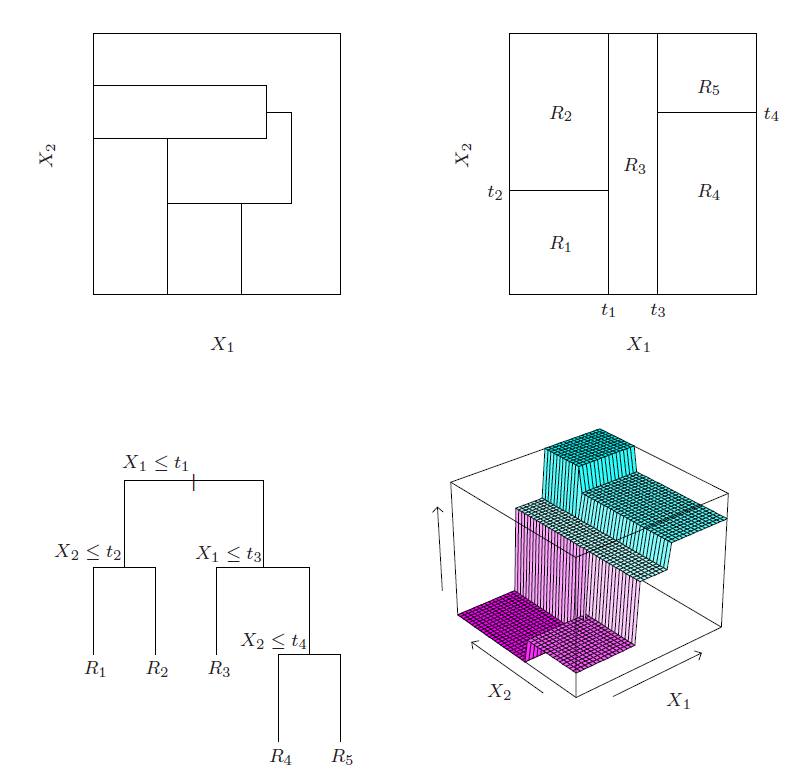
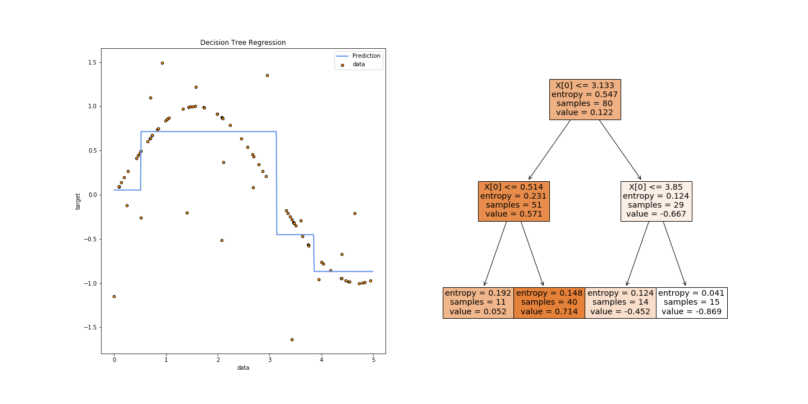
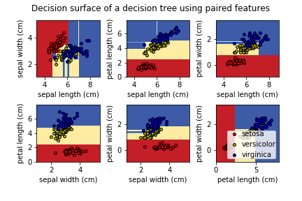
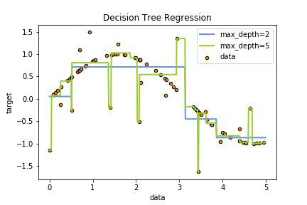

## Introducción

Este es el primer articulo en una serie sobre uno de los algoritmos de _machine learning_ con mayor éxito en los últimos años: _Gradient Boosting Decision Trees (GBDT)_. Para empezar, cubriremos el estimador base sobre el cual se construye este algoritmo: los árboles de decisión. No voy a cubrir la implementación con Python en este caso porque no vale la pena—esta es netamente una explicación teórica necesaria para entender lo que viene más adelante (que si será implementado con ejemplos).

Hace poco en una conversación me pidieron que explique la diferencia entre _Random Forests_ Y _GBDT_, y aunque sabía que ambos métodos se sustentaban en arboles de decisión y pensaba tener un _working knowledge_ suficiente para aplicarlos, me di cuenta que mi comprensión conceptual era muy superficial. Hasta ahora me había contentado con aprender sobre las diferentes implementaciones, sin mucha consideración por la parte teórica. Pero para poder implementar estos métodos en problemas de _machine learning_ en un contexto real—con circunstancias y consecuencias reales—este conocimiento es fundamental.

Básicamente, es como manejar un auto sin entender como funciona: No es necesario para un conductor casual, pero si eres un piloto de F1 y tu éxito o fracaso depende directamente de tu capacidad en sacarle el mejor desempeño posible al auto (y más aún cuando un error tiene consecuencias graves), entonces es distinto.

Y como dicen que la mejor forma de aprender algo es tratar de explicárselo a alguien más, estas guías van a ser mi forma de cubrir los vacíos teóricos que quedan. Ojala te sirvan también para obtener una comprensión conceptual de estas técnicas, y cuando quieras llevarlo al siguiente nivel y vayas a un recurso más profundo como [Este buen libro disponible online](https://web.stanford.edu/~hastie/ElemStatLearn/) ya tengas al menos la parte conceptual cubierta. La documentación de Scikit-learn también cuenta con muy buenos recursos para aprender y es muy recomendable.

## Conceptos básicos

Un árbol de decisión es un método de estimación no paramétrico con muy buena capacidad de modelar datos heterogéneos (variables continuas y categóricas) y con buena tolerancia al ruido introducido por variables no relevantes.

El algoritmo es muy intuitivo, al representar de manera matemática el proceso que (a uno le gustaría pensar) usamos de manera intuitiva para llegar a una decisión o predicción: Comenzando desde arriba, se desarrollan una serie de reglas en base a los atributos disponibles para descartar opciones que no cumplen, hasta llegar a un resultado ideal para dichas condiciones (pensar en como Dr. House realizaba sus diagnósticos… presenta éste síntoma, por lo que no puede ser ésta condición, pero no presenta este otro así que no puede ser esa… podría ser lupus?).

En el ejemplo anterior, si una flor tiene un largo de pétalo inferior a 2.45cm, debe ser tipo _setosa_. Si en cambio es mayor, y además el ancho del pétalo es mayor a 1.75cm, pero el largo del pétalo es mayor a 4.85cm, entonces debe ser del tipo _virginica_ (Notar que en este caso el atributo “largo de pétalo” aparece dos veces—esta es una ventaja de este estimador que le permite capturar relaciones complejas.)

El árbol cuenta con dos tipos de nodos: los nodos internos (de _tests_ o de _split_) generan una bifurcación en los datos que recibe, y los nodos externos ya no realizan _splits_, sino que cuentan con una predicción y consisten en el final de la rama (por eso se les llaman nodos hoja o _leaf_).

Gráficamente, también se puede representar (para dos variables explicativas de manera simple) como una partición del espacio en rectángulos en base a valores de quiebre en las variables explicativas, hasta obtener un espacio segmentado que consiste en distintas regiones—cada una correspondiendo a una predicción.

En el panel de arriba a la izquiera se muestra una partición ideal, y el de abajo a la izquierda un arbol de decisión intentando aproximarse a ésta. En el panel de arriba a la derecha se muestra el espacio que resulta de este árbol, y abajo a la derecha la superficie de predicción. Fuente: Elements of Statistical Learning, 2nd Edition.

Existen múltiples algoritmos que implementan esta estrategia, pero esta explicación se va a concentrar en **CART** (Classification and Regression Trees), que obtiene los _splits_ de manera recursiva, y es el método más comúnmente implementado en las librerías como Scikit-learn. Cómo se determinan los _splits_ va a depender de si la variable a explicar es continua (regresión) o categórica (clasificación).

## Problemas de regresión

Cuando la variable a predecir ($y_{i}$) es continua, el resultado final va a ser un árbol que termina asignando una constante a cada uno de sus nodos externos—es decir en la figura anterior R1 tendría un valor, R2 tendría otro, etc. ¿Qué valor debería tomar cada constante? El promedio de $y_{i}$ al interior de cada región logra la mejor predicción en términos de minimizar el error cuadrático (cómo una regresión lineal clásica). La siguiente figura muestra un árbol simple para un modelo con una sola variable explicativa, donde el gráfico de la izquierda muestra como la predicción (la línea azul) corresponde al promedio de la variable a predecir en cada región obtenida por el algoritmo. En este caso, la primera región corresponde a $X \leqslant 0.514$, la segunda a $0.514 <  X \leqslant 3.133$, y así sucesivamente.

Y ¿cómo se determina cada región? Para cada variable $j$ y punto de quiebre $s$, el algoritmo va a separar los datos en dos regiones y calcular el error cuadrático medio, de manera recursiva, para cada variable disponible y los valores que toma (agrupados en intervalos discretos en el caso de variables continuas). La combinación de _(variable, valor)_ que resulta en el menor error cuadrático se convierte en un _split_.

Y si un nodo no realiza más splits, se convierte en un nodo hoja que realiza una predicción, que corresponde al promedio de la variable a predecir ($y_{i}$) dentro de la región.

## Problemas de clasificación

Cuando la variable a predecir es categórica (dos clases para clasificación binaria o más de dos para multi-clase), el procedimiento es similar a la regresión en que el algoritmo genera recursivamente particiones en el espacio de variables explicativas, pero en este caso con el objetivo de obtener los nodos más _puros_ posibles—es decir que cada nodo quede lo más concentrado posible en una sola clase.

CART usa el _gini index_ para calcular la _impureza_ que se obtiene en un nodo luego de un _split_, tomando valor 0 si el nodo contiene solo muestras de una misma clase, y aumentando en la medida que el nodo tiene más variabilidad en su interior. Otros algoritmos usan la _entropía_ de teoría de la información, pero a pesar del cálculo distinto suelen tomar valores similares—en la implementación de Scikit-learn el default es `criterion="gini"`, pero se puede cambiar a `criterion=“entropy”`.

Eventualmente, cuándo un nodo no puede realizar más quiebres porque ya está completamente puro, o se llegan a restricciones en el tamaño del árbol ú otros hiper-parámetros, el nodo se convierte en una hoja que predice la clase con mayor representación en dicho nodo.

Estos cuadros de la documentación de Scikit-learn muestran las regiones y sus correspondientes predicciones que se generan al entrenar distintos árboles usando solamente dos variables explicativas a la vez (para poder visualizar más fácilmente).

## Controlando el crecimiento

En la medida que hayan _splits_ que mejoren la medida de impureza correspondiente (gini para clasificación o error cuadrático medio para regresión) el algoritmo va a continuar tratando de agregar nodos. Pero un árbol excesivamente complejo puede rápidamente terminar sobre-entrenado, y con bajo poder de generalización a datos que nunca ha visto. Es por esto que existen hiper-parámetros que comúnmente se usan para regular la topología del árbol, y son relevantes más adelante cuando uses un algoritmo más complejo como _random forests_ o _gradient boosting_ porque en su base también dependen de estos árboles.

### Tamaño del árbol

El principal parámetro a controlar es el tamaño del árbol, calculado como el recorrido más largo desde la raíz hasta el último nodo. El árbol de regresión de más arriba, por ejemplo, tiene un tamaño de 2. En la mayoría de las implementaciones, este hiper-parámetro se llama `max_depth`, y es uno de los más importantes. Como se muestra en esta figura, cambiando la dimensión desde 2 a 5 aumenta considerablemente el riesgo de sobre-entrenar el modelo. Parte del arte es encontrar el valor para este parámetro que maximice la capacidad predictiva sin sobre-entrenar.

Tomar en cuenta también el número de observaciones disponibles: el número necesario para construir un árbol se duplica con cada nivel que se agrega, por lo que ante una muestra pequeña es aún más importante tomar en cuenta este parámetro.

### Numero mínimo de observaciones por _leaf_

Controlado por el hiper-parámetro `min_samples_leaf` en la mayoría de las implementaciones, este regula el número mínimo de observaciones que tienen que haber en un nodo **para que éste pueda ser considerado un nodo externo o _leaf_**. Un número bajo permitirá árboles más profundos y complejos, pero con mayor riesgo de _overfitting_ (especialmente para regresiones). La documentación de Scikit-learn recomienda comenzar con `min_samples_leaf = 5` para problemas de regresión, y `min_samples_leaf = 1` para problemas de clasificación binaria o con pocas clases.

### Numero mínimo de observaciones por _split_

Controlado por el hiper-parámetro `min_samples_split` en la mayoría de las implementaciones, este regula el número mínimo de observaciones que tienen que haber en un nodo **para que éste pueda hacer un _split_**. Por ejemplo, si `min_samples_split = 5` y un nodo tiene 7 observaciones, entonces intentará hacer un _split_. Pero si este resulta en un nodo que tiene 6 observaciones y otro que tiene solo 1, este _split_ puede ser revertido si el mínimo permitido en un nodo para que sea válido como nodo externo (`min_samples_leaf`) es mayor a 1. Al igual que con `min_samples_leaf`, valores bajos permiten árboles más complejos con mayor riesgo de _overfitting_.

## Interpretando los resultados

Uno de los principales beneficios de los árboles de decisión es su fácil interpretabilidad, al menos desde el punto de vista de las predicciones finales. Además en general es muy fácil graficar un árbol y evaluar visualmente su forma. Sin embargo, muchas veces es necesario interpretar los efectos que las variables explicativas tienen en el resultado, y esto es un poco más complejo que en una regresión lineal donde esto es directamente observable en los parámetros calculados.

Es importante entender cómo se calcula la importancia de las variables al nivel de un árbol individual, porque al extender la metodología a los métodos de _ensemble_ la única diferencia es que toma el promedio sobre todos los árboles estimados. Notar también que distintas implementaciones (CatBoost, XBGoost, LightGBM) usan métricas levemente distintas entre sí, por lo que igual es necesario leer su documentación para entender qué se está midiendo.

### Gini Importance

También conocido como _gini impurity_ (y como Mean Decrease Impurity (MDI) cuando es promediado sobre varios árboles como en _random forests_) es una de las principales métricas usadas en los algoritmos que se basan en árboles de decisión. Para calcularlo, recordar que un árbol consiste en una serie de _splits_, cada uno en un nodo con un número de observaciones y una variable explicativa.

Para calcular esta métrica, básicamente se suma cuánto mejora el criterio de impureza (cuánto cae el _gini index_ en el contexto de clasificación con CART por ejemplo) en cada nodo (ponderando por el número observaciones que llegan a este) para cada variable explicativa. Cuando está escalado a 1 (como en la implementación de Scikit-learn) entonces la interpretación es directamente el porcentaje de la predicción que es atribuible a cada variable. [Este _thread_ de _stackexchange_](https://stats.stackexchange.com/questions/311488/summing-feature-importance-in-scikit-learn-for-a-set-of-features) tiene una explicación más completa con la matemática necesaria.

Una consideración importante es que las variables que se encuentren “más arriba” en el árbol van a tener siempre mayor relevancia.

## Shortcomings

A pesar de su versatilidad y capacidad, esta técnica no es perfecta y tiene algunas fallas—que justamente son explotadas por los métodos de _ensemble_ como _random forests_ y _gradient boosting_ para obtener un buen estimador a partir de un conjunto de estimadores malos.

- Inestabilidad: Un cambio muy sutil en los datos usados—tan solo un par de observaciones distintas—pueden resultar en un árbol completamente distinto (aunque con capacidad predictiva similar).
- Propensión a _overfit_: Los árboles—si no son controlados mediante los hiper-parámetros mencionados—tienden crecer fuera de control y a sobre-entrenar los datos muy rápidamente.
- Baja tolerancia a clases desbalanceadas: Si los datos están muy cargados a una clase en particular (por ejemplo si tratando de clasificar el no-pago de un crédito solo 5% de la muestra presenta este evento) entonces el estimador va a resultar con un considerable sesgo.
