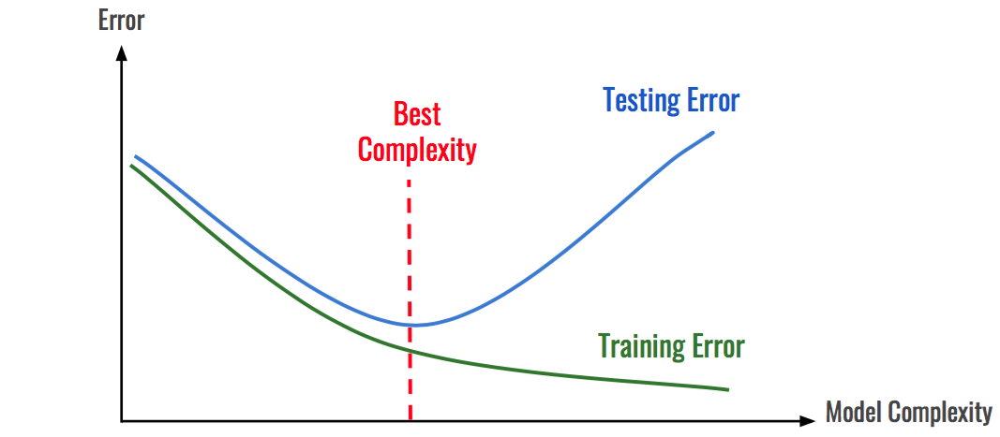

## Links rápidos

- [Part 1: Árboles de decisión](/arboles-de-decision/)
- [Part 2: Random Forests](/random-forests/)
- [Repositorio con el código](https://github.com/jcaguirre89/gboost)

## Introducción

Finalmente hemos llegado a **Gradient Boosting Decision Trees (GBDT)**—el final en esta serie que introduce el modelo de **machine learning** que por 5 años ya (una eternidad a la velocidad que avanzan estas cosas) ha estado liderando las competencias de data science y potenciando varias de las aplicaciones que usas día a día. Su éxito se debe a una combinación única de calidad predictiva, velocidad de entrenamiento (requiriendo menor intensidad computacional), y capacidad de recibir cualquier función objetivo (mientras sea diferenciable) lo que le permite resolver problemas de regresión o clasificación sin muchos ajustes necesarios.

Esta técnica se me hizo bastante más complicada de entender en profundidad, y por eso no voy a tratar de cubrirla desde 0 en este post—hay recursos mucho mejores que creo que hacen un mejor trabajo de lo que podría hacer acá y son necesarios para entender bien la teoría. Recomiendo partir con [este post](http://blog.kaggle.com/2017/01/23/a-kaggle-master-explains-gradient-boosting/) que construye el algoritmo de manera intuitiva con un ejemplo simple, y luego [esta serie de 3 posts](https://explained.ai/gradient-boosting/index.html) que también toman un _approach_ gradual y ahondan un poco más en la matemática detrás.

En vez, voy a tomar un enfoque un poco distinto que asume un conocimiento básico, y es lo que me ayudó a mi a cimentar la teoría: construir el algoritmo en Python desde 0. Ver en código el proceso en vivo me dejó muy claro cada paso y los efectos de distintas funciones de pérdida, estimadores base, etc.

## Repaso rápido de la teória

La técnica consiste básicamente en estimar una serie de estimadores débiles de manera **secuencial**, con cada
estimador corrigiendo los errores del estimador anterior. Esta imágen que tomé de uno de los posts recomendados más arriba es una buena forma de visualizar el proceso:


En términos matemáticos, en cada paso $m$ se va a construir un estimador $f_m(x)$ sobre los residuos (técnicamente el gradiente, no los residuos, pero como veremos más adelante en el caso del error cuadrático medio como función de pérdida, estos coinciden) entre la variable objetivo y la estimación del paso anterior $f_{m-1}(x)$. Al final del proceso, el estimador final $F_m(x)$ consistirá en un estimador base $f_0$---que puede ser una serie de 0’s, el promedio, la mediana, etc.---y una sumatoria de $m$ estimadores débiles $f_m(x)$, ajustados por un parámetro de regularización $\eta$ que afecta la contribución de cada estimador al estimador final (conocido en inglés como _shrinkage_ o _learning rate_) para controlar el _overfitting_.

$$
F_M(x) = f_0 + \eta \sum_m^M f_m(x)
$$

Donde el algoritmo secuencial implica que cada estimador durante la etapa $m$ toma la siguiente forma:

$$
F_m(x) = F_{m-1}(x) + \eta f_m(x)
$$

Uno de los principales atractivos de ésta técnica es que es te permite usar distintas funciones de pérdida, lo que le da un montón de flexibilidad; sin embargo, yo creo que la forma más fácil de entenderlo es tomando el caso de la regresión (variable dependiente contínua), tomando como función de pérdida el error cuadrático medio---esta función tiene la gracia de que su gradiente equivale a los residuos comunes $y - f(x)$.

En este caso, el algoritmo consiste en:

1. Partir de un estimador base $F_{0}$ (por ejemplo el promedio de la variable objetivo)
2. Calcular el gradiente (residuos entre la variable objetivo y este estimador): $y - F_0(x)$
3. Estimar un estimador débil a estos residuos $f_1(x) = y - F_0(x)$
4. Actualizar el estimador agregado con esta nueva estimación $F_1(x) = F_0 + \eta f_1(x)$
5. Repetir los pasos 2-4 $m$ veces. El siguiente paso calcularía un estimador débil $f_2(x)$ sobre los residuos $y - F_1(x)$, para obtener $F_2(x) = F_1 + \eta f_2(x)$, y así sucesivamente.

## Show me the code

Este proceso es mucho más fácil de apreciar mirando una implementación simple en código. Sin embargo, mirar los códigos base de implementaciones populares como las de Scikit-learn o XGBoost son de poca ayuda porque hacen muchos ajustes de optimización y versatilidad que mejoran la calidad del estimador pero implican demasiadas líneas de código, lo que hace difícil apreciar el algoritmo de fondo.

Lo que sigue es una implementación que quita todo el _fluff_ del proceso y deja los puros huesos—sorprendentemente (para mi) logrando sin embargo capacidad predictiva bastante competitiva. Pueden ver un notebook con algunas comparaciones en el mismo repositorio, o directamente [acá](https://github.com/jcaguirre89/gboost/blob/master/example.ipynb).

Empecemos con la función de pérdida. Este ejemplo simple va a soportar tres tipos: error cuadrático, error absoluto, y la función logística (para clasificación binaria). Todos los ejemplos que vi haciendo research para este post se concentran en regresión, porque es tanto más fácil interpretar el algoritmo con la función de error cuadrática como hice más arriba, pero quiero que este post demuestre también como el algoritmo es extendible a otros problemas, dándole la versatilidad que lo hace famoso.

Definiremos el gradiente de cada función de pérdida de manera simple, con las siguientes funciones:

```python
def mse_gradient(y, f):
    """
    Error cuadrático medio, cuyo gradiente
    es equivalente a los residuos
    """
    return y - f


def lad_gradient(y, f):
    """
    Error absoluto, cuyo gradiente
    es 1.0 si y - pred > 0.0 y sino -1.0
    """
    return 2.0 * (y - f > 0) - 1.0


def logistic_gradient(y, f):
    """
    Función logistica para clasificación, cuyo gradiente es
    y - expit(x). expit(x) es la funcion logistica:  1/(1+exp(-x))
    """
    return y - expit(f)
```

Con las distintas funciones para los _pseudo-residuos_ listas, podemos pasar a implementar el algoritmo. Para el cuerpo principal, tendremos:

```python
class GBoost:
    def __init__(
        self,
        n_estimators=100,  # Tambien referido como M arriba
        learning_rate=0.1,
        loss='ls', # funcion de perdida default: error cuadratico medio
        tol=0.5  # Solo relevante para clasificacion
        ):

        # Inicializar argumentos
        self.n_estimators = n_estimators
        self.learning_rate = learning_rate
        self.tol = tol
        # Definir estimadores inicial y base
        self.first_estimator = DummyRegressor(
            strategy='constant',
            constant=0
            )
        self.base_estimator = DecisionTreeRegressor(max_depth=1)
        # Definir función de pérdida
        if loss == 'lad':
            self.gradient = lad_gradient
        elif loss == 'ls':
            self.gradient = mse_gradient
        elif loss == 'logistic':
            self.gradient = logistic_gradient
        else:
            raise AttributeError(f'Unknown loss function: {loss}')
```

Como estimador inicial usaremos simplemente un vector de 0's que tomará el tamaño correspondiente a la variable objetivo. Esta es la primera gran diferencia con las implementaciones reales, que usan uno especifico para distintas funciones de pérdida (promedio para el error cuadrático, mediana para error absoluto, etc.). Luego, como estimador base se define un árbol de decisión simple que podrá realizar solamente un _split_---ciertamente muy restrictivo pero encarnando el espíritu de tomar estimadores _débiles_ como base.

Luego vienen las implementaciones del algoritmo, repartidas entre una función para estimar: `fit`, y otra para predecir: `predict`, que como veremos ahora están ligadas por el proceso de estimación secuencial. Voy a empezar describiendo el algoritmo para el caso de regresión, y luego describiré los ajustes necesarios para realizar clasificación.

```python {7-14}
def fit(self, X, y):
    # Inicializar lista para estimadores debiles
    self._estimators = [self.first_estimator]
    # Paso 0
    F = self.first_estimator.fit(X, y)
    # Empezar proceso secuencial
    for m in range(self.n_estimators):
        # Paso 1: predecir usando todos los estimadores
        # debiles entrenados hasta este momento
        F = self.predict(X)
        # Paso 2: Calcular pseudo-residuos del paso anterior
        residuals = self.gradient(y, F)
        # Paso 3: Estimar nuevo estimador débil a estos residuos
        f = clone(self.base_estimator).fit(X, residuals)
        # Paso 4: Guardar este estimador para
        # incluirlo en la prediccion del paso 1
        self._estimators.append(f)
        # repetir pasos 2-4 M veces
    return self

def predict(self, X):
    # Tomar el estimador base
    f_0 = self._estimators[0].predict(X)
    # Y sumarle las predicciones ajustadas de cada estimador debil
    boosting = np.sum(
        [ self.learning_rate * f.predict(X)
				for f in self._estimators[1:] ],
        axis=0
        )
    return f_0 + boosting
```

Toda la magia está realmente en las líneas resaltadas. El paso 1 consiste en llamar el método `predict`, que va a tomar todos los estimadores almacenados en la lista `_estimators` para calcular la predicción, es decir, equivale a $F_m = F_0 + \eta F_1 + \eta F_2 + ...$. Luego se toma esta predicción y se llama al método `gradient` definido previamente para calcular los residuos en el paso 2, pero ahora debería quedar más claro que en realidad no tienen por qué ser necesariamente los residuos, sino que cualquier función que describa una divergencia entre la variable objetivo y la estimación. El paso 3 estima el nuevo estimador, pero usando los residuos como variable objetivo (la función auxiliar `clone` de scikit-learn solamente sirve para crear una copia).

### Extendiendo a clasificación

Este estimador, tal cual está definido, puede realizar clasificación en lugar de regresión sin ninguna modificación necesaria---el algoritmo es el mismo. Sin embargo, la predicción va a ser imposible de interpretar, ya que debe ser convertida nuevamente por la función logística en una probabilidad, y luego en la clase correspondiente. Esto se puede lograr agregando los siguientes métodos a la clase:

```python
def _proba_to_class(self, sample):
    """
    Método auxiliar para convertir
    probabilidad en clase, dada una tolerancia
    """
    return int(sample > self.tol)

def predict_class(self, X):
    """ Convierte prediccion en clase binaria {0, 1} """
    # Convertir prediccion en probabilidad
    predicted_probas = expit(self.predict(X))
    # Convertir probabilidad en clase
    return np.array(
      [self._proba_to_class(sample) for sample in predicted_probas]
      )
```

Con estos dos métodos finales terminamos la implementación, que con toda la funcionalidad básica y desempeño comparable a las de _full scale_, pero sin los controles ni optimizaciones, alcanza menos de 50 líneas.

```python
from sklearn.base import clone, BaseEstimator
from sklearn.tree import DecisionTreeRegressor
from sklearn.dummy import DummyRegressor

import numpy as np
from scipy.special import expit

class GBoost(BaseEstimator):
    def __init__(self, n_estimators=100, learning_rate=0.1, loss='ls', tol=0.5):
        self.n_estimators = n_estimators
        self.learning_rate = learning_rate
        self.tol = tol  # Relevante solo para clasificación
        self.first_estimator = DummyRegressor(strategy='constant', constant=0)
        self.base_estimator = DecisionTreeRegressor(max_depth=1)
        if loss == 'lad':
            self.gradient = lad_gradient
        elif loss == 'ls':
            self.gradient = mse_gradient
        elif loss == 'logistic':
            self.gradient = logistic_gradient
        else:
            raise AttributeError('Unknown loss function: {}'.format(loss))

    def fit(self, X, y):
        self._estimators = [self.first_estimator]
        F = self.first_estimator.fit(X, y)
        for m in range(self.n_estimators):
            F = self.predict(X)
            residuals = self.gradient(y, F)
            f = clone(self.base_estimator).fit(X, residuals)
            self._estimators.append(f)
        return self

    def predict(self, X):
        f_0 = self._estimators[0].predict(X)
        boosting = np.sum([self.learning_rate * f.predict(X) for f in self._estimators[1:]], axis=0)
        return f_0 + boosting

    def _proba_to_class(self, sample):
        """ método auxiliar para convertir probabilidad en clase, dada una tolerancia """
        return int(sample > self.tol)

    def predict_class(self, X):
        """ Convierte prediccion en clase binaria {0, 1} """
        predicted_probas = expit(self.predict(X))
        return np.array([self._proba_to_class(sample) for sample in predicted_probas])
```

## Conclusiones

Espero que este proceso haya esclarecido un poco el algoritmo detrás de estos estimadores, y te de más confianza a la hora de usar una implementación real como XBoost, LightGBM o CatBoost. Cada una de estas aplica diferentes técnicas para mejorar la calidad predictiva, velocidad de entrenamiento, tratamiento de variables categóricas, etc. que le dan su merecido reconocimiento; sin embargo, en el fondo el algoritmo es el mismo y con una buena comprensión de este y los mecanismos que los subyacen se hace más abordable el proceso de descubrir sus funcionalidades y características.

En términos de estrategias generales a la hora de estimar, me gustaría escribir otro post dedicado a estas
implementaciones y como usarlas con problemas de la vida real. En términos generales, esta técnica es mucho más
susceptible a _overfitting_ que random forests, por lo que es más importante tener cuidado—una técnica común es _early
stopping_, que consiste en entregar al estimador una función de pérdida adicional junto con un set de validación que
no es usado para entrenar (o usar _out-of-bag_ como vimos en [el post anterior en la serie sobre random
forests](/random-forests/)). Con estos, se calcula un _test score_ o _test error_ que describe la capacidad de generalización del modelo durante cada etapa $m$ de entrenamiento, y al momento que este empieza a empeorar significa que el modelo esta _overfitting_ y detiene el proceso. Esta técnica tiene 0 costo de implementar, y en cambio no solo garantiza la mejor generalización posible con los parámetros dados, sino que además disminuye potencialmente los tiempos de estimación y predicción, por lo que es altamente recomendada.



Otra consideración importante es que a menor _learning rate_, menor es el riesgo de _overfitting_ también, sin embargo se van a requerir más estimadores para converger a un optimo.
