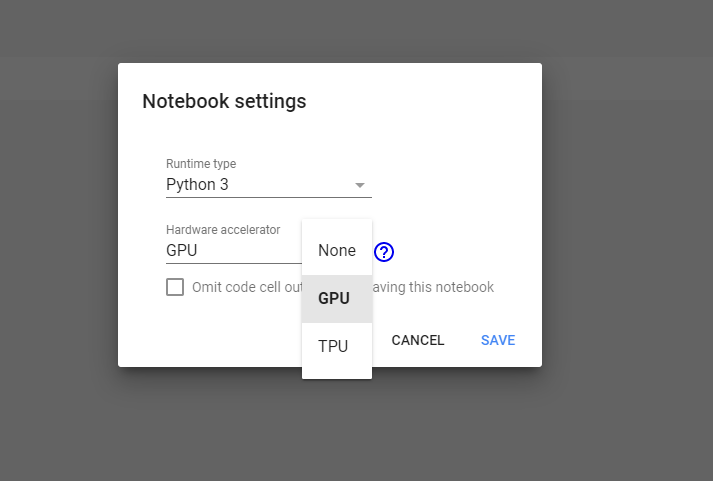
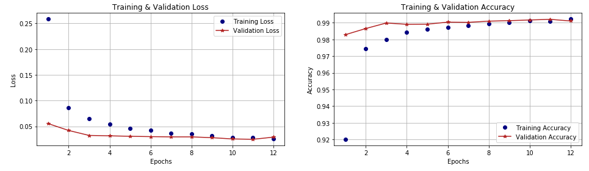
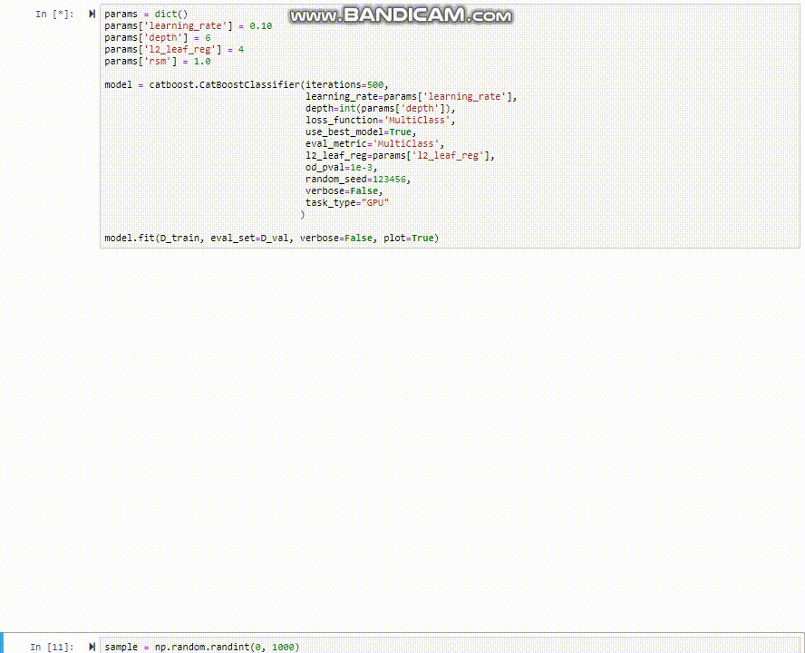

## Introduccion

Los algoritmos de _machine learning_ que están en la frontera del conocimiento y sustentando todas las aplicaciones con inteligencia artificial que han surgido en los últimos años son las redes neuronales (_Deep Learning_) y _Gradient Boosted Decision Trees_.

Gracias a librerías abiertas como [Tensorflow](https://www.tensorflow.org/) y [Keras](https://keras.io/) para el primero, y [LightGBM](https://lightgbm.readthedocs.io/en/latest/), [XGBoost](https://xgboost.readthedocs.io/en/latest/) y [CatBoost](https://catboost.ai/) para el segundo, estos complejos algoritmos están al alcance de todos—solo basta un conocimiento intermedio de un lenguaje de programación como Python o R. Pero cualquiera que trate de implementarlos en un computador personal se dará cuenta rápidamente que es un proceso increiblemente lento—después de todo una red neuronal puede tener más de un millón de parámetros que calcular en cada iteración.

La ventaja de usar GPU en lugar de CPU como motor de procesamiento es que está optimizado para realizar cálculos de matrices de grandes dimensiones, haciendo que el proceso de entrenamiento (que consiste principalmente en estos cálculos de álgebra lineal) sea mucho más rápido.

Este breve articulo no va a mostrarte como usar estas librerias o lenguajes (eso se lo dejo a otro articulo mas extenso que podría venir en el futuro o las documentaciones respectivas) pero si como implementarlas en la nube, aprovechando la capacidad computacional de Google con [Google Colab](https://colab.research.google.com/). Este servicio es al proyecto Jupyter como Google Docs es a Microsoft Office: una alternativa online y gratis—con 90% de la misma funcionalidad—y un poco extra.

Más abajo voy a compartir links para cada uno de los notebooks que hice (uno para Keras y otro para CatBoost). Cada link va a a llevarte al notebook en google colab. De ahi puedes guardar una copia en tu Google Drive o en Github. Estos links van a llevarte a la versión de "view only", y para poder editarla tienes que hacer click donde dice "Open in Playground", lo que va a crear una versión para ti, comparable con lo que sería un "fork" en kaggle. De ahí, puedes guardarla en tu Google Drive o subirla a Github.

## Introduccion a Google Colab

Lo primero que vas a ver es una ventana que te da opciones para crear un notebook nuevo, o abrirlo desde distintas fuentes. Para crear uno nuevo solo haz click abajo a la derecha donde sale _NEW PYTHON 3 NOTEBOOK_, o puedes abrir un jupyter notebook (archivo con extension `.ipynb`) directamente desde Github si contectas tu cuenta, desde Google Drive, o simplemente cargarlo desde tu computador.

Una vez en un notebook, la interfaz es bien similar a Jupyter, pero los comandos de teclado no funcionan igual (hasta donde yo sé) lo que lo hace solo un poco más lento navegar porque hay que usar más el mouse—no ideal pero tampoco deal breaker. Los importantes, como CTRL+Shift+Enter para correr la celda y avanzar a la siguiente al menos funcionan igual.

### Dependencias Externas

El kernel ya viene con librerías típicas para data science instaladas, como tensorflow y pandas, y si quieres usar una que no esta (como CatBoost), la puedes instalar insertando y corriendo `!pip install catboost` en un bloque de código (al igual que en jupyter, anteponiendo un ! al código es equivalente a correr un comando en la terminal).

### Activar GPU

Para activar GPU, haz click en “Runtime” en el menu de arriba y luego selecciona “Change runtime type”. Aparecera un menú como este donde solo tienes que seleccionar “GPU” y listo!

Si en algún minuto aparece una advertencia de que el notebook está corriendo al límite de la memoria, solo presiona “Ignorar”.



## Deep Learning

[Este notebook](https://colab.research.google.com/drive/14Gn5qi3rVBv-5hPJvZTnEeXe26z231s1) usa Keras y el famoso MNIST de clasificación de dígitos del 0 al 9 escritos a mano para crear un _Convolutional Neural Network (CNN)_—el _state-of-the-art_ en análisis de imágenes—para crear un modelo que identifica y predice una imagen de un dígito que **nunca ha visto** con un 99% de exactitud. Este modelo en particular lo tomé directamente de los ejemplos en la documentación de Keras, y si bien la técnica en si de CNN es muy avanzada y compleja, esta red de juguete en particular es órdenes de magnitud más simple de la que usaría facebook por ejemplo para reconocer y auto-taggear caras. Y cuánto se demora en aprender, procesando 60,000 imágenes? **menos de 1 minuto**! Solo por jugar, prueba corriéndola sin hacer el cambio a GPU para ver cuanto tardaría en CPU como si lo hicieras desde tu computador personal.

Como se observa en los gráficos de desempeño, podríamos haber entrenado solo hasta la séptima iteración (recortando el tiempo que demora en la mitad) y quedaríamos prácticamente con la misma precisión. Por qué es importante la velocidad? no se trata solamente de la impaciencia (aunque a nadie le gusta esperar de más), pero cuando estas explorando un modelo, normalmente vas a entrenar una y otra vez, cada vez alterando un _hyper-parámetro_ ú otro para ver que pasa. Pasando de 10 minutos a 20 segundos es un cambio drástico!



## Gradient Boosted Descent Trees

Este algoritmo tomó mucha prominencia cuando XGBoost salió el 2014, impresionando con la mezcla de precisión, versatilidad y eficiencia. Desde entonces han salido más versiones, entre las que destacan LightGBM (de Microsoft) y CatBoost. Hasta ahora solo había usando personalmente LightGBM, que destaca por la velocidad en CPU, pero desde que tengo la posibilidad de usar GPU me pasé a CatBoost porque se hace increíblemente fácil de cambiar entre uno y otro, mientras que con LightGBM el proceso de instalación es una pesadilla. Además—aunque no he visto muchos benchmarks—dicen que CatBoost es incluso más rápido que LightGBM en GPU!

[En este notebook](https://colab.research.google.com/drive/1T8Fm9x99gFxAjb2eWwcFCbDEqwcm9N91) pueden ver la misma implementación para la base MNIST pero con CatBoost. Al igual que con Keras, no voy a cubrir el algoritmo o el uso de la librería porque da para uno (o varios) por si solo, pero en la [documentación de XBoost](https://xgboost.readthedocs.io/en/latest/tutorials/model.html) hay una buena explicación del algoritmo.

Para usar GPU en vez de CPU, solo hay que agregar un parámetro en la definición del modelo que especifica el uso de GPU, y listo!

```python
model = catboost.CatBoostClassifier(iterations=500,
                                    learning_rate=0.1,
                                    depth=6,
                                    loss_function='MultiClass',
                                    use_best_model=True,
                                    eval_metric='MultiClass',
                                    l2_leaf_reg=4,
                                    od_pval=1e-3,
                                    random_seed=123456,
                                    verbose=False,
                                    task_type="GPU"  # esta linea dice: Usar GPU
                                   )

model.fit(D_train, eval_set=D_val, verbose=False, plot=True)
```

CatBoost tiene una funcionalidad muy útil para visualizar el proceso de entrenamiento que desafortunadamente no funciona en los notebooks de Google Colab, sino que solo directamente en jupyter notebooks (ni siquiera en jupyter lab). Si tienes la oportunidad (y tiempo/GPU disponible) prueba corriendo este mismo notebook desde jupyter para ver como el modelo entrena en tiempo real.


