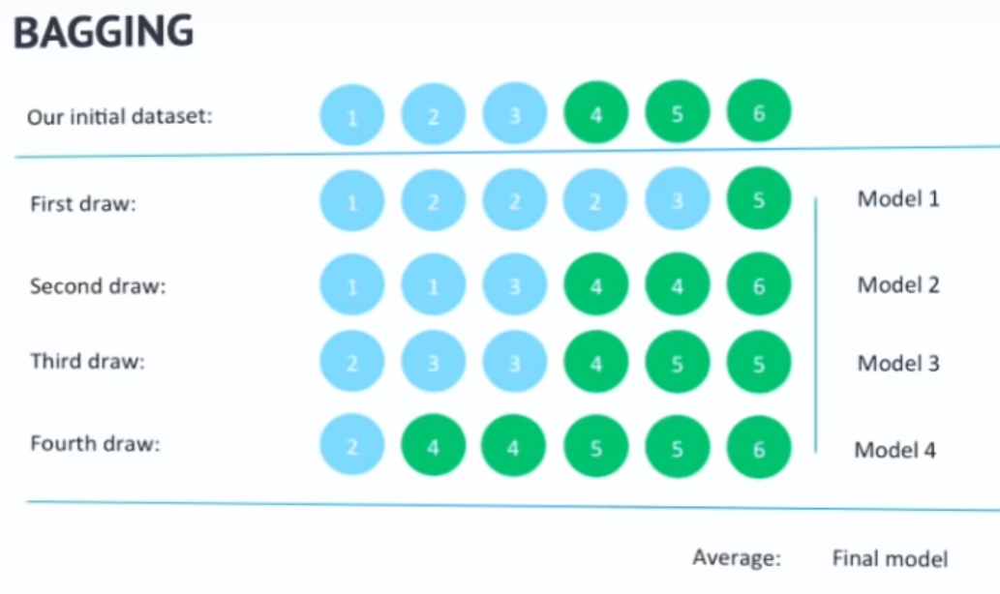
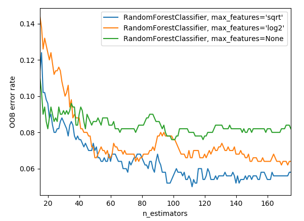

## Introducción

Este es el segundo articulo en la serie sobre _machine learning_ con foco en los métodos basados en árboles de decisión ([árticulo anterior en la serie](/arboles-de-decision/)). Al igual que en el anterior, el foco va a estar más sobre la parte teórica que la práctica, ya que el objetivo es construir sobre la base anterior los conceptos necesarios para entender mejor el _Gradient Boosting Decision Tree_—el algoritmo que supera a estos en casi todas las aplicaciones y que vale la pena realmente aprender a usar.

## Ensemble Methods

Los árboles de decisión tienen muchas ventajas, destacando su capacidad de tolerar variables continuas o categóricas sin mucha preparación necesario, su interpretabilidad, y de percibir y modelar relaciones no lineales en los datos. Sin embargo, su capacidad predictiva no es muy buena, cayendo fácilmente victimas de _overfitting_ al crecer árboles muy profundos. Además, los árboles sueles ser muy inestables a cambios sutiles en los datos---cambiar solo un par de observaciones puede afectar drásticamente en la forma que tomará el modelo. Estos factores hacen que el árbol de decisión sea un estimador con bajo sesgo pero _alta varianza_, obteniendo resultados distintos al tomar distintas muestras de la misma población.

De esta inestabilidad surge la oportunidad para los _ensemble methods_—modelos que combinan múltiples estimadores, cada uno a partir de una muestra distinta, en un estimador agregado que reduce considerablemente el error de generalización al tener menor varianza. Las dos familias principales de estos modelos son:

- _Averaging/Bagging methods_: varios estimadores son combinados de manera simple, promediando el valor (o probabilidad en el caso de clasificación) o por un sistema de votación.
- _Boosting methods_: Los estimadores son agregados de manera secuencial, cada uno buscando mejorar marginalmente el desempeño del anterior.

En este articulo cubriremos el método de _bagging_ más popular: _random forests_.

## Random Forests

_Random Forests_ es una metodología que estima no uno sino muchos árboles, introduciendo aleatoriedad (de ahí el nombre) en la construcción de cada árbol en el "bosque". Esta técnica, conocida como _perturb-and-combine_, aprovecha la inestabilidad inherente en los árboles de decisión para terminar con un conjunto de árboles muy diferentes entre sí, cada uno capturando una relación levemente distinta.

La aleatoriedad es introducida de dos formas:

- _bagging_: Para construir cada árbol, se toman aleatoriamente observaciones con reemplazo hasta tener otra muestra del mismo tamaño que la original, pero con menos observaciones únicas. [Se puede estimar](https://stats.stackexchange.com/questions/88980/why-on-average-does-each-bootstrap-sample-contain-roughly-two-thirds-of-observat?lq=1) que la muestra que resulta del _bagging_ contiene aproximadamente $\frac{2}{3}$ de observaciones únicas y $\frac{1}{3}$ queda sin utilizar. Como resultado, dos árboles distintos no verán las mismas observaciones necesariamente y por lo tanto resultarán con estructuras distintas (e ideálmente complementarias). Las observaciones que quedan fuera del árbol pueden ser aprovechadas para calcular un score de validación, ya que funcionan como un _holdout set_, y veremos más adelante como funciona en la implementación.
  <figure>
    
    <figcaption>
      Un ejemplo de como se aplicaría bagging a un problema de clasificación con
      2 clases, verde y azul, tomando varias sub-muestras con reemplazo sobre la
      muestra original para generar múltiples modelos distintos.{" "}
      <a
        href="https://www.youtube.com/watch?v=s3VmuVPfu0s&t=2m50s"
        target="_blank"
        rel="nofollow noreferrer noopener"
      >
        Fuente
      </a>
    </figcaption>
  </figure>
- Sub-conjunto de atributos: Además de restringir el numero de observaciones, para cada _split_ en cada nodo del árbol se toman en consideración solamente un sub-conjunto aleatorio de todos los atributos (variables explicativas) disponibles.

Al introducir aleatoriedad, la varianza y el sesgo de cada estimador individual _aumenta_, sin embargo la varianza se compensa entre los estimadores del _ensemble_ para resultar en un estimador agregado un poco más de sesgo, y con _menor_ varianza que sus componentes—suficiente para compensar el aumento en el sesgo. Esto, a su vez, **resulta en un menor error de generalización y una considerable resiliencia al _overfitting_.**

### Agregando los resultados

Una vez que se tiene un bosque de árboles entrenados, hay que agregarlos para llegar a una predicción final. El método de agregación depende del tipo de problema que se está abordando:

- Regresión: Se toma el promedio de la predicción de todos los árboles. Por ejemplo, dada la observación con atributos $x_{1}=4$ y $x_{2}=8$, en un bosque de 2 árboles puede que uno prediga $\hat{y}=5$ y el otro $\hat{y}=7$, entonces la predicción agregada será $\hat{y}=6$.
- Clasificación: Dependiendo de la implementación, se puede tomar el promedio de la probabilidad (de que la observación pertenezca a una clase dada) predicha por cada árbol o se puede implementar un sistema de votación con mayoría simple—si el bosque tiene 10 árboles, y para una observación dada 6 árboles predicen clase 1 y los 4 restantes predicen clase 0, entonces la clase predicha por el estimador agregado es 1. Scikit-learn utiliza votación, pero además ponderando por la probabilidad, de manera que—efectivamente—la clase predicha por el estimador agregado es la que tiene la mayor probabilidad promedio entre todos los árboles. Esta técnica se conoce como _soft-voting_.

## Implementación con Scikit-Learn

_Scikit-learn_ incluye este estimador para clasificación y regresión. Los hiper-parámetros disponibles consisten en los inherentes a los árboles de decisión (revisados en el [árticulo anterior en la serie](/arboles-de-decision/)), y además algunos adicionales que regulan el bosque:

- `n_estimators`: El número de árboles a estimar. Mientras más mejor (aunque con rendimiento decreciente), pero a costo de tiempo en entrenar.
- `max_features`: Número máximo de atributos a considerar al realizar cada _split_. Un numero mas bajo resultara en una mayor reducción en la varianza del estimador final, a costo de un mayor sesgo. La documentación de Scikit-learn recomienda **empezar** (y luego validar) con `max_features=n_features` (donde `n_features=numero de atributos`) para problemas de regresión y `max_features=sqrt(n_features)` para problemas de clasificación—Scikit-learn cuenta con un _shortcut_ para decidir esto automáticamente, usando el valor que viene por default: `'auto'`.
- `bootstrap`: Toma valores `True` o `False`, y es `True` por default. Si se cambia a `False`, entonces se usará toda la muestra para cada árbol en lugar de _bagging_ como se describió previamente.
- `oob_score`: Toma valores `True` o `False`, y es `False` por default. Viene de la sigla en ingles para **O**ut-**O**f-**B**ag Score que se puede traducir como puntaje fuera de muestra. Como se mencionó previamente, la técnica de _bagging_ permite calcular un score de validación con las observaciones que quedaron fuera de la muestra para cada árbol. Luego de crear y entrenar el modelo, este valor estará disponible bajo el atributo `oob_score_`, que entrega una medida de precisión sobre las observaciones no utilizadas. Esto permite obtener un estimador insesgado del error de generalización (`1 - oob_score_`) [sin la necesidad de usar _cross-validation_ o una muestra adicional](https://www.stat.berkeley.edu/~breiman/RandomForests/cc_home.htm). [Este código](https://scikit-learn.org/stable/auto_examples/ensemble/plot_ensemble_oob.html) muestra como graficar el error de generalización para distintas configuraciones, y su evolución a medida que se agregan árboles al bosque—de manera que resulta muy útil para evaluar y comparar modelos. 
- `random_state`: Recibe un `int`, que será usado como _seed_ para generar la aleatoriedad en el modelo. Es importante definirlo ya que permite la reproducibilidad (dilo 10 veces rápido) de los resultados. Ejemplo: `random_state=42`.

### Lidiando con clases desbalanceadas

Un problema común en muchos problemas de clasificación, los estimadores basados en árboles de decisión son muy vulnerables a muestras con clases desbalanceadas—por ejemplo en una muestra de pacientes que hay que clasificar entre con o sin alguna enfermedad en base a sus síntomas, pero solo un 5% de la muestra usada para entrenar presenta dicha enfermedad.

Este es un problema bien documentado y existen varias formas de abordarlo, y acá solo voy a cubrir una de estas que me parece bien rápida y fácil. El objetivo es _re-balancear_ la muestra para que las clases con baja representación sean más prominentes. En Scikit-learn, esto se puede hacer con el argumento `sample_weight` que se pasa a la hora de llamar el método `fit` sobre el estimador. Este argumento recibe una lista o tuple, con los pesos que se le debería dar a _cada observación_—Es decir el tamaño de esta lista debe ser igual al número de observaciones.

Por ejemplo, si la variable a predecir es la siguiente lista de clases: `y = [0, 0, 0, 1, 0, 1, 0]`, tal vez querríamos darle más peso a las observaciones con clase `1`, entonces usaríamos el siguiente código:

```python
# Datos falsos
n_samples = 6
X = [[np.random.randint(0, 10), np.random.randint(0, 10)]
     for _ in range(n_samples)]
y = [0, 0, 0, 1, 0, 1]
print(X, y)
# Instanciar clasificador con argumentos default
clf = RandomForestClassifier()
# Darle el doble de peso a las observaciones con clase 1
weights = [1, 1, 1, 2, 1, 2]
# Confirmar que tienen el mismo tamaño
assert len(weights) == len(y)
# Entrenar, pasando los pesos especificados
clf.fit(X, y, sample_weight=weights)
```

Pero en ejemplos reales, es impracticable asignar un peso a cada observación, y por eso la librería tiene [una función](https://scikit-learn.org/stable/modules/generated/sklearn.utils.class_weight.compute_sample_weight.html) que los calcula en base a un diccionario con cada clase y el peso deseado. Para usarla, solo hay que definir un diccionario con cada clase y su peso correspondiente, y esta función devuelve la lista que el método `fit` necesita.

```python {16-21}
from sklearn.ensemble import RandomForestClassifier
from sklearn.model_selection import train_test_split
from sklearn import datasets
from sklearn.utils import compute_sample_weight

iris = datasets.load_iris()

clf = RandomForestClassifier(
    n_estimators=100,
    max_features='auto',
    max_depth=None,
    min_samples_split=2,
    oob_score=True,
    random_state=42,
)
# Darle 5 veces más peso a la clase 0 que a la 1 o 2.
class_weights = {0: 5, 1: 1, 2: 1}
sample_weights = compute_sample_weight(
    class_weight=class_weights,
    y=iris.target
)

print(sample_weights)
clf.fit(iris.data, iris.target, sample_weight=sample_weights)
```
