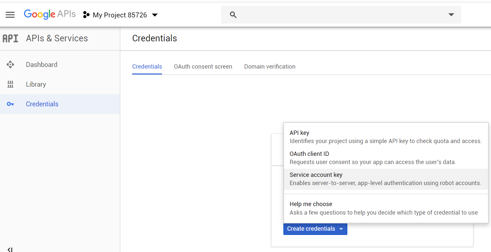
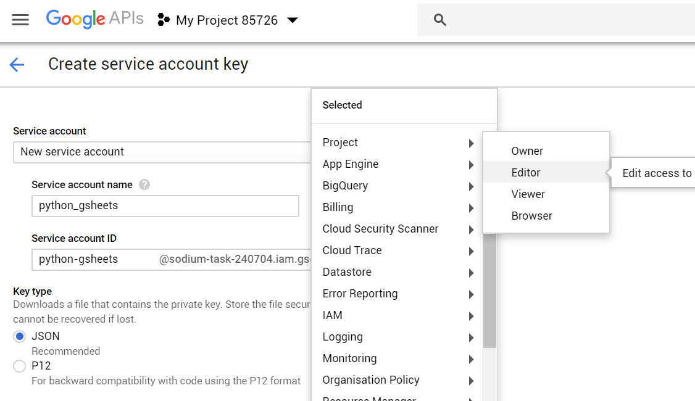
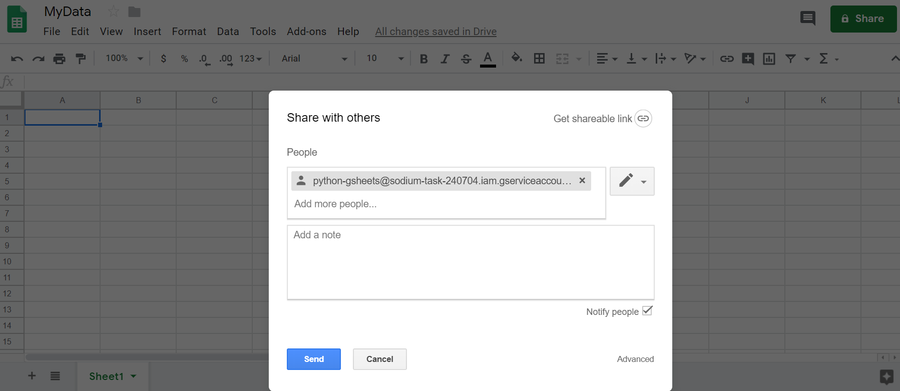
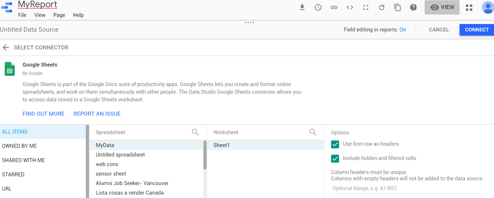

## **Motivation**

Reporting sucks. It feels kind of silly how easy it has become to access the very bleeding edge in some technologies—building and training neural networks with millions of parameters, setting up intricate data processing pipelines, getting creative with visualization libraries—only to have it all culminate in a shitty powerpoint&trade; presentation or a bland pdf document. And then when someone asks for an update 2 months later...🤯🔫.

“What about Jupyter notebooks?“ you must be wondering… they’re a great tool to showcase an analysis piece—think kaggle kernels—but I think they’re closer to replacing a standalone project rather than something that you would send to clients or your boss with some frequency.

Another good alternative is Plotly’s [Dash](https://dash.plot.ly/):

> Written on top of Flask, Plotly.js, and React.js, Dash is ideal for building data visualization apps with highly custom user interfaces in pure Python. It's particularly suited for anyone who works with data in Python.

I’d say Dash is a great tool if you need more advanced visualizations, but it’s definitely an order of magnitude more involved because besides all of the additional coding required, you need to figure out hosting. Heroku is a great option in terms of simplicity, but it doesn’t come cheap.

This tutorial will show you how to set up a data pipeline to ingest and clean some data, and then present it with nice, interactive dashboards that can be freely shared and exported to pdf. Once you're done, you'll have online reports with interactive visualizations and filtering, that will be a breeze to update and share with you're end users.

## The pipeline

Our first task is setting up a data processing pipeline, which will run periodically to ingest the data and clean it up. Maybe it's in a SQL database, or it gets dumped in some folder or S3 bucket as CSV files, maybe you have some code scraping a website, maybe you hook up to an API... this step is obviously going to be completely project dependent, but the general workflow is always the same; read the data into pandas dataframes, process it (add/remove columns, fill missing values, merge and denormalize, etc.), and then export to google sheets. This is an ooold workflow traditionally referred to as **E**xtract **T**ransform **L**oad.

### Getting data

On this occasion, we’ll be using the [NYPD motor collisions data](https://data.cityofnewyork.us/Public-Safety/NYPD-Motor-Vehicle-Collisions/h9gi-nx95). It gets updated daily, and each record represents a collision with information like precinct, borough, involved vehicles, etc.

We’ll write a python script that gets and cleans the data. This is where you’ll denormalize it if you’re reading from multiple tables (in case you’re reading from a SQL database), add new columns, clean them up, etc. I like doing this step in Jupyter notebooks first, which allows me to interact directly with the data and see what needs to be done. Once I’m more familiar with the data and happy with the transformations required, I’ll put them all together into a script like this one.

```python
# data_processing.py
import pandas as pd

def get_data():
    """ Gets data. Returns a pandas df """
    base_url = 'https://data.cityofnewyork.us/resource/qiz3-axqb.json'
    df = pd.read_json(base_url)
	return df

def clean_data(df):
    """ Cleans data. Returns a pandas df """

    # Make a copy so the function remains pure
    df = df.copy()

    # Let's drop some columns that we won't use
    drop_cols = [col for col in df.columns if col.startswith(':')]
    drop_cols.append('location')
    df.drop(drop_cols, axis=1, inplace=True)

    # Looks like the street names need to be stripped
    street_cols = [
        'cross_street_name',
        'off_street_name',
        'on_street_name',
        ]
    for col in street_cols:
        df[col] = df[col].str.strip()

    # Create lat,long col
    df['coordinates'] = df['latitude'].astype(str) +
                        ', ' +
                        df['longitude'].astype(str)

	return df

def etl():
    """ Main function. Gets and cleans data. Returns a pandas df """
    df = get_data()
    df = clean_data(df)
    return df
```

There’s nothing very fancy going on in this file, and what you do with the data depends on what you have so there’s no point in covering it here. What does deserve some attention is how you structure the process. Here I split the work into 2 different functions, one to load the data and another one to transform it. Then I put both together into a third function that I’ll call later for the full process.

The benefit of splitting it into separate functions is that it makes it much easier to test, debug and maintain. If your cleaning process is more complex than what I have here (and most likely it is) it may make sense to split things further into individual functions for each step. If you’re coming from a Jupyter notebook where you did the initial exploration, it will probably be a very direct conversion from each code bock into its own function.

## Exporting to Google sheets

Next, we need to export the data to google sheets. To do all the heavy lifting we’ll use the great library [gspread](https://github.com/burnash/gspread), which is very well documented and easy to start using right out of the gate. But we’ll only be using a small portion, that will allow us to dump the data into a pre-determined sheet.

First thing is getting credentials from the google developers console. [This section of the gspread docs](https://gspread.readthedocs.io/en/latest/oauth2.html) covers it but I’ve found it to be a bit outdated—or at least partially incomplete—so I’ll cover it here as well. UI’s are constantly changing so I won’t rely to heavily on it, most steps are relatively easy to figure out.

1. Go to [the google developers console](https://console.developers.google.com/) and create a new project—call it whatever you want.
2. You’ll be taken to the project dashboard. Right there in the middle you should see a link that says “+ ENABLE APIS AND SERVICES”. Go there, search for “Google Drive API” and click on enable. Then go back and search for “Google Sheets API” and enable as well. Go back to the main project dashboard.
3. To the left, you’ll see a menu that has 3 items as of this writing: Dashboard, Library and Credentials. Go to credentials, and create a new _service account key_.
4. Give the service account a name, and give it the “Editor” role (note that the 'sodium-task-xxx' name was randomly generated by google). 
5. Save the output to your project directory as `google_secrets.json`
6. Now you must create the google sheet, and share it with the email created for that service account (in my case `python-gsheets@sodium-task-240704.iam.gserviceaccount.com`). You can also find that email address inside the json file you just downloaded. You’ll realize you forgot this step if you later get a `SpreadsheetNotFound` error when running the code.

Once that’s done, we’ll define some functions that will help us create, open and write to sheets. Put these functions in a file that we’ll call from the main one. The main function we’ll call here, `paste_csv`, will go to a given tab within a given spreadsheet, delete all contents and paste a given CSV string. You can adjust this code to append the data to the bottom instead of overwriting—if you want to preserve the data—although I would suggest against it.

If the goal was collecting historic data instead of (or in addition to) just reporting on the current status, I would edit the process to append the pandas dataframe to the bottom of a CSV file and then write another piece of code that reads the data from this file and dumps whatever you need into the google sheet—basically separating the tasks of building a historic database and reporting on it. I prefer this approach because google sheets isn’t really made to handle millions of rows, so even if you start small your dataset will eventually grow enough that you’ll have to make the switch anyways—why not do it from the start.

```python
# gspread_utils.py
import gspread
from oauth2client.service_account import ServiceAccountCredentials


def get_client(creds_file='google_secrets.json'):
    """
    use creds to create a client to interact
    with the Google Drive API
    :param creds_file: 'clients_json
    :return: gspread Client object
    """
    scope = ['https://spreadsheets.google.com/feeds' +
             ' ' +
             'https://www.googleapis.com/auth/drive']
    creds = ServiceAccountCredentials.from_json_keyfile_name(creds_file,
                                                             scope)
    client = gspread.authorize(creds)
    return client


def get_last_row(tab):
    """ Helper function to find last row with data """
    last = tab.row_count
    if last < 1:
        return 1
    return last


def get_last_col(tab):
    """ Helper function to find last col with data """
    last = tab.col_count
    if last < 1:
        return 1
    return last


def clear_contents(tab):
    """ Delete all data in a given tab
    (must be a gspread sheet object) """
    last_row = get_last_row(tab)
    last_col = get_last_col(tab)
    range_of_cells = tab.range(1, 1, last_row, last_col)
    # This section is not very performant (to put it mildly) but it
    # still only takes a few seconds for thousands of rows. While the
    # goal of this script is to run offline, this is not a big issue.
    for cell in range_of_cells:
        cell.value = ''
    tab.update_cells(range_of_cells)


def paste_csv(csv_data, sheet,
              tab_name='Sheet1',
              starting_cell='A1'):
    '''
    Deletes content in sheet (if exists) and pastes csv data
    csv_data - csv string
    sheet - a gspread.Spreadsheet object
    cell - string giving starting cell
    '''
    # If the tab doesn't exist, create it
    try:
        tab = sheet.worksheet(tab_name)
    except:
        tab = sheet.add_worksheet(title=tab_name,
                                  rows="20", cols="5")
    clear_contents(tab)

    (first_row, first_column) = gspread.utils.a1_to_rowcol(starting_cell)

    body = {
        'requests': [{
            'pasteData': {
                "coordinate": {
                    "sheetId": tab.id,
                    "rowIndex": first_row-1,
                    "columnIndex": first_column-1,
                },
                "data": csv_data,
                "type": 'PASTE_NORMAL',
                "delimiter": ',',
            }
        }]
    }
    sheet.batch_update(body)
```

Now let’s put both pieces of code together into a third file.

```python
# etl_gsheets.py
import gspread_utils
import data_processing

def main():
    """ gets clean data and dumps into google sheets """

    # Get data
    df = data_processing.etl()

    # Send to Google sheets
    client = gspread_utils.get_client(creds_file='google_secrets.json')
    # MyData is the name of the google sheet
    sheet = client.open('MyData')
    gspread_utils.paste_csv(df.to_csv(index=False),
                            sheet,
                            tab_name='Sheet1',
                            starting_cell='A1')

if __name__ == '__main__':
    print('Starting..')
    main()
    print('All done!')
```

Now for the moment of truth, go to the shell and run the code:

```bash
$ python etl_gsheets.py
```

If all goes well, you should go to your google sheet and see the data there. Hooray! Now whenever you run this command, the entire pipeline will kick in, getting the data, cleaning it up and dumping it in the Google Sheet you gave it.

## Data Studio Dashboard

Now we’ll create a data studio report and populate it with the data we just created. The tool is a very simple, yet powerful visualization tool that allows easy report creation and sharing. I’d say the sharing portion is the standout feature: you can share it freely and aren’t restricted like with paid products (Power BI, Tableau, etc.). Another feature I like a lot is how easy it is to embed them, as they make an html snippet readily available to copy and paste wherever you want (scroll to the bottom to see mine). While you have a much more limited spectrum of available visualizations (no fancy force graphs here) I find it’s offering is almost always more than enough—remember the goal here is replacing an excel chart anyway.

I won’t cover it’s usage too much here—you just have to play around with it. Unfortunately, you’ll find that most users come from google analytics and therefore most of the data handling is already taken care of for them because you can connect directly to it—and other data sources too, which is actually pretty neat. However, this means it’s harder to find help online—the [google-data-studio] StackOverflow tag has just 555 questions as of this writing.

### Creating the report

1. Go to https://datastudio.google.com and create a new report.
2. Click on “Create new data source” or something like that. It will probably be to the right.
3. Scroll down until you find “Google Sheets”. Click there, and look for your newly created spreadsheet, and then click on “Connect”. 
4. You’ll see all your columns there, colorized the way data studio breaks down your data: greens are dimensions and blues, metrics. In very simple terms, dimensions are columns that represent categories through which you can slice your data (country, date, sector, etc.) and metrics are the values that you want to visualize (income, temperature, etc.). You can adjust the data types if any was read incorrectly, and define formatting and aggregation preferences (average for percentages, sum for money, etc.). You can also create new fields, but I found this to be much easier to do in the python data processing layer. This also applies to blended data, which is a data studio feature that allows merging data sets like classic SQL JOINS, but again, I prefer doing all of these within python and just dumping the data ready to visualize.
5. Once in the main panel, you can switch between the EDIT and VIEW modes to edit your report. I won’t cover all the features here, but encourage you to just play around with it—it is mostly pretty intuitive and if you can’t figure out how to do a specific thing (apply filter to a subset of charts, add default to dropdown list, etc.) you’ll probably find the answer in google. While the data connection side has small online support because most people use it for google analytics, the report building and visualizations community is much more active because of this as well.
6. Each object (chart, filter, text box) has a DATA and a STYLE tab in the control bar to the right, where you can determine what the object will display and formatting. Depending on the visualization, you can choose one or more dimensions, which are the green-colored columns that correspond to categorical variables, and metrics, the blue-colored ones that represent values. You can also select a “Date Range Dimension” that allows you to use the “Date Range” filter, in addition to regular filters.

## Finished product

As mentioned earlier, reports are very easy to share and publish. You can set rules to define who can view or edit it, and get an html snippet to embed into websites as you can see below. Note the "Full Screen" symbol on the bottom-right corner (so you don't have to squint).

<iframe
  width="600"
  height="600"
  src="https://datastudio.google.com/embed/reporting/1j5qPRTX_Xcsf1ubuoCEBRTlCzsuor0R_/page/cvfp"
  frameborder="0"
  style="border:0"
  allowfullscreen
/>

## Next steps

Now you're done with the basic version. Want to kick it up a notch and go fully automated? move this code over to an AWS Lambda function and set it to [run on a fixed schedule](https://docs.aws.amazon.com/lambda/latest/dg/with-scheduled-events.html) or whenever your data updates.
